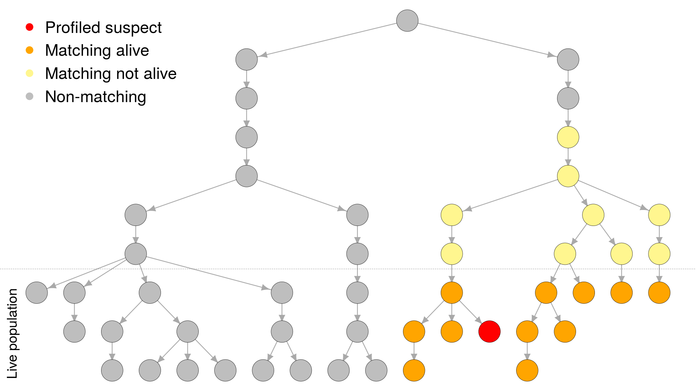

# Summary

Forensic DNA profiles from the Y-chromosome are valuable when there is a mixture of male-source and female-source DNA, and interest centres on the identity of the male source(s) of the DNA (as only males have Y-chromosomes). 
This happens for example when a male has been accused of assaulting a female. 

The problem of evaluating evidential weight is even more challenging for Y-profiles than for autosomal profiles that are based on the non-sex chromosomes.
At the core of the weight of evidence for autosomal short tandem repeat (STR) profiles used in forensic genetics is the *match probability*, which is the conditional probability that a particular individual $X$ has a matching profile, given that the queried contributor, $Q$, has it [@DJBwoe2]. 
Matching at a single, autosomal STR allele is relatively common: typically a few percent of individuals from the same population share a given allele. 
The probability of matching is increased when $X$ is a relative of $Q$, but for typical population sizes most of the individuals sharing a given allele are not closely related to $Q$.

However, unlike for autosomal profiles, Y-profile matches are due to patrilineal relatedness that is typically too remote to be recognized, but close compared with the relatedness of random pairs from the population [@AndersenPLOSGEN2017].
This was described by [@AndersenPLOSGEN2017] that also propose a way to interpret a matching Y-chromosomal profile given these properties.
The proposed interpretation was based on the distribution of the number of males with Y-profile matching that of the queried contributor $Q$.
Analyses in [@AndersenPLOSGEN2017] were performed by 
a simulation model to approximate the distribution of the number of men in a population with matching Y-profiles.
Key parameters of the model include the STR locus mutation rates, the variance in reproductive success [@AndersenPLOSGEN2017] (VRS), and the population growth rate. 
The simulation model was implemented and made available in the easy-to-use open-source software presented in this paper: `malan` (**MA**le **L**ineage **AN**alysis). 

The `malan` software is made available as an R [@R] package with extensive use of C++ for efficient computations via Rcpp [@Rcpp]. 
This software was used for the analyses performed in [@AndersenPLOSGEN2017].
The simulation model allows for flexible simulations by first simulating a genealogy (with population sizes at each generation specified by a vector) with different parameters as described by [@AndersenPLOSGEN2017]. 
A forensic Y-chromosome profile typically consists of the allele at between 15 and 30 STR loci [@Butler05] and is often referred to as a Y-STR haplotype. 
In the simulated genealogy, the `malan` software makes it possible to impose Y-STR haplotypes in different ways. 

The `malan` software makes it possible to query the population in multiple ways. For example to count the number of males in the population with a certain Y-STR haplotype. Or obtain the distribution of number of meioses between a queried contributor and the individuals in the population with a matching Y-STR haplotype.

The documentation of `malan` consists of manual pages for the various available functions, articles describing how to perform contiguous analyses (*vignettes*), and unit tests.

I would like to thank David J Balding for helpful discussions.

-

# References
